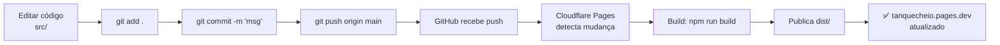
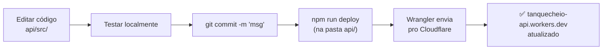

# 🚀 Guia de Deploy — Tanque Cheio v1.6+

Documentação para fazer deploy do Frontend (Cloudflare Pages) e Backend (Cloudflare Workers).

---

## 📋 Quick Start

### Frontend (automático)
```bash
git add .
git commit -m "seu mensagem"
git push origin main
# Cloudflare Pages detecta automaticamente e faz deploy
```

### Backend (manual)
```bash
cd api
npm run deploy
```

---

## 🔧 Setup Inicial (uma vez)

### Pré-requisitos
- Node.js 24+ instalado
- Git conectado ao GitHub
- Conta Cloudflare com:
  - ✅ Workers configurado (`tanquecheio-api`)
  - ✅ Pages configurado (`tanquecheio`)
  - ✅ D1 Database (`tanquecheio-db`)
  - ✅ R2 Bucket (`tanquecheio-storage`)

### Autenticação Wrangler
Na primeira vez, você precisa autenticar com Cloudflare:

```bash
cd api
npx wrangler login
```

Isso abre o navegador. Clique em **"Authorize"** e pronto.

---

## 📱 Frontend (Cloudflare Pages)

### Fluxo de Deploy



### Passos no VS Code

1. **Editar arquivos**
   ```
   src/App.tsx, src/features/home/HomePage.tsx, etc.
   ```

2. **Commitar**
   ```bash
   git add .
   git commit -m "feat: adicionar XYZ"
   ```

3. **Push**
   ```bash
   git push origin main
   ```

4. **Acompanhar deploy** (opcional)
   - Vá em [dash.cloudflare.com](https://dash.cloudflare.com)
   - **Workers & Pages** → **Pages** → **tanquecheio**
   - Aba **"Deployments"**
   - Status muda: `Building...` → `Success`
   - Leva ~30-60 segundos

### Testar Localmente (antes de push)
```bash
npm run dev
# Abre em http://localhost:5173
```

---

## ⚙️ Backend (Cloudflare Workers)

### Fluxo de Deploy



### Passos no VS Code

1. **Editar arquivos**
   ```
   api/src/routes/, api/src/middleware/, api/src/lib/, etc.
   ```

2. **Testar Localmente** (opcional mas recomendado)
   ```bash
   cd api
   npm run dev
   # Servidor fica em http://localhost:8787
   ```

3. **Commitar**
   ```bash
   git add api/
   git commit -m "fix: correção no HMAC"
   ```

4. **Deploy para Cloudflare**
   ```bash
   cd api
   npm run deploy
   ```

5. **Acompanhar**
   - Terminal mostra:
     ```
     ✓ deployed tanquecheio-api
     → https://tanquecheio-api.danielbritto88.workers.dev
     ```
   - Leva ~10-20 segundos

---

## 🧪 Testando Antes de Deploy

### Frontend
```bash
npm run build
npm run preview
# Abre a versão buildada em http://localhost:4173
```

### Backend
```bash
cd api
npm run dev
# Servidor local em http://localhost:8787
```

---

## 🔄 Fluxo Completo (Frontend + Backend)

Se você mexeu em **ambos** frontend e backend:

```bash
# 1. Testar frontend
npm run build
npm run preview
# Abrir em http://localhost:4173 e testar

# 2. Testar backend
cd api
npm run dev
# Em outro terminal, testar endpoints

# 3. Commitar tudo
git add .
git commit -m "feat: nova funcionalidade XYZ

- Frontend: componente novo
- Backend: endpoint novo
- HMAC: verificação adicionada"

# 4. Deploy automático do Frontend
git push origin main
# Aguarda ~1 minuto

# 5. Deploy manual do Backend
cd api
npm run deploy
# Aguarda ~20 segundos
```

---

## ❌ Troubleshooting

### "Build failed" no Cloudflare Pages
1. Vá em **Pages** → **tanquecheio** → **Deployments** → clique no build falhado
2. Leia o log completo
3. Erros comuns:
   - **TypeScript errors**: `npm run build` localmente mostra o erro
   - **Missing imports**: cheque a ortografia de imports
   - **Missing dependencies**: adicione com `npm install`

### "assinatura inválida" no Worker
- Certificar que **middleware HMAC foi deployado**:
  ```bash
  cd api
  npm run deploy
  ```

### "npm: command not found"
- Node.js não está instalado
- Reinstale de https://nodejs.org (versão 24+)

### "Wrangler not authenticated"
```bash
cd api
npx wrangler login
```

---

## 📊 Status dos Deploys

### Verificar último deploy (Frontend)
[Cloudflare Pages - Tanquecheio](https://dash.cloudflare.com)
- Workers & Pages → Pages → tanquecheio → Deployments

### Verificar último deploy (Backend)
[Cloudflare Workers - Tanquecheio API](https://dash.cloudflare.com)
- Workers & Pages → Workers → tanquecheio-api → Deployments

---

## 🚨 Rollback (voltar versão anterior)

### Frontend
1. Vá em **Pages** → **tanquecheio** → **Deployments**
2. Clique no deployment anterior (verde ✓)
3. Clique em **"Rollback to this deployment"**

### Backend
1. Vá em **Workers** → **tanquecheio-api** → **Deployments**
2. Clique no deployment anterior (verde ✓)
3. Clique em **"Rollback"**

Alternativa: `git revert` + push (frontend) ou `npm run deploy` (backend) com código anterior.

---

## 📝 Resumo de Comandos

| Ação | Comando |
|------|---------|
| **Dev Frontend** | `npm run dev` |
| **Build Frontend** | `npm run build` |
| **Preview Frontend** | `npm run preview` |
| **Dev Backend** | `cd api && npm run dev` |
| **Deploy Backend** | `cd api && npm run deploy` |
| **Login Wrangler** | `cd api && npx wrangler login` |
| **Git commit** | `git add . && git commit -m 'msg'` |
| **Git push** | `git push origin main` |

---

## 🔐 Environment Variables

### Frontend
- Nenhuma obrigatória (tudo vem do Worker)
- Se adicionar: coloque em `.env.local` e `.env.*.local`

### Backend
- Configuradas no **wrangler.toml** ou dashboard Cloudflare
- Variáveis: `VAULT_PASSWORD`, `JWT_SECRET`, `ALLOWED_ORIGINS`
- Para testar localmente: use `.dev.vars` (não commitar!)

---

## 📚 Recursos

- [Cloudflare Pages Docs](https://developers.cloudflare.com/pages/)
- [Cloudflare Workers Docs](https://developers.cloudflare.com/workers/)
- [Wrangler CLI](https://developers.cloudflare.com/workers/wrangler/)
- Repo local: `PROJETO.md` (arquitetura geral)
